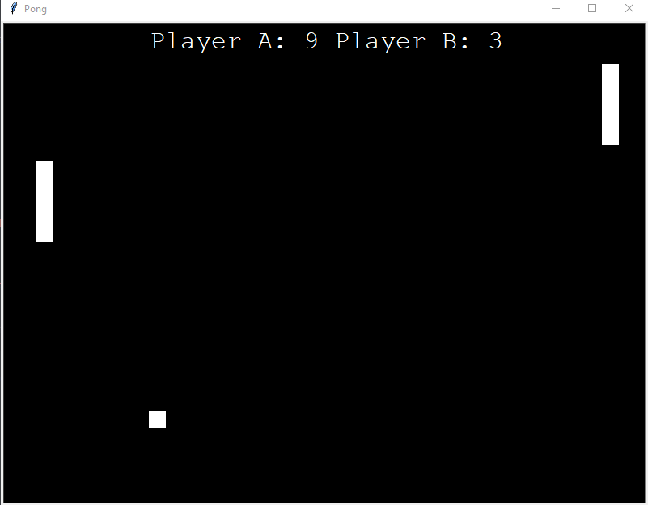

# Pong written in Python

This tiny project is just a simple implementation of pong with the python
turtle library. This was meant for getting familiar with the turtle library
and creating a simple/clean implementation of pong!

The left player can use `w` and `s` to move up and down.
The right player can use up arrow and down arrow to move up and down.

A sound is played when there's any collision however the library is windows
specific hence it will only work on a windows machine as is.

To run the game: `python pong.py`
NOTE: You need to execute `python3 pong.py` on Linux/Mac (there won't be any sound on these platforms)

## Screnshot of the exciting and revolutionary gameplay

